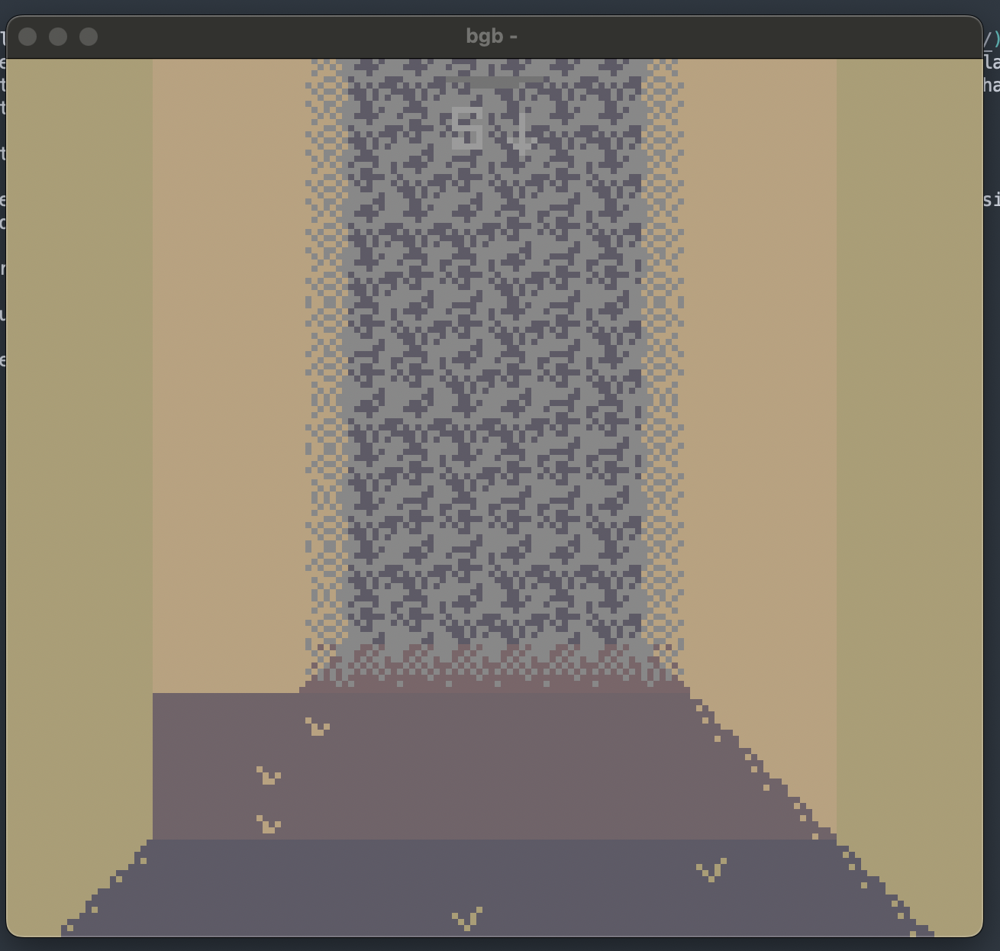
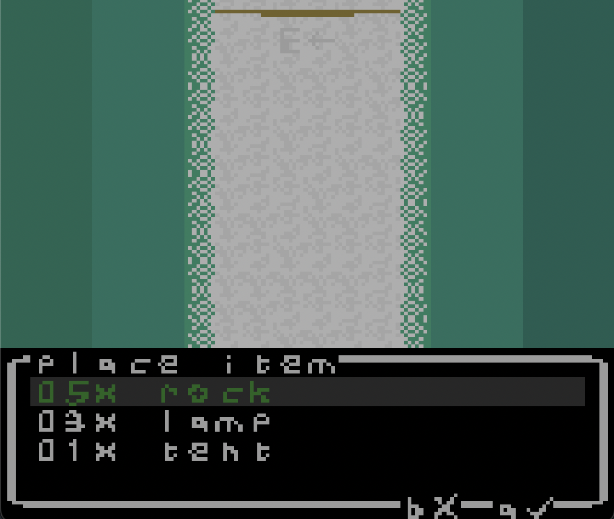
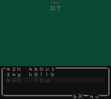
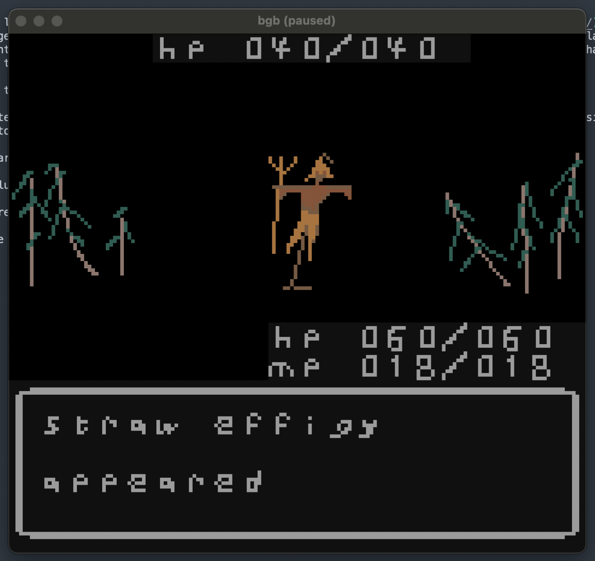
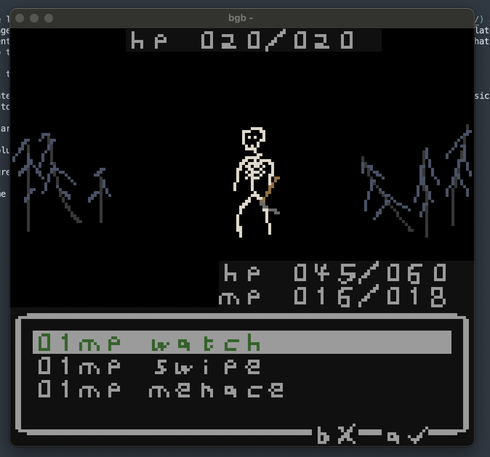
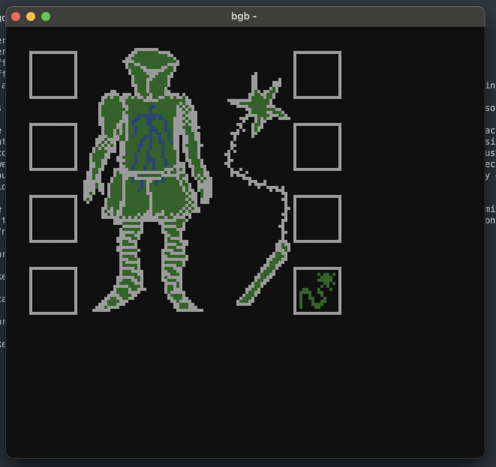

a first person dungeon crawler for the gameboy color

written with rgbds

some in-progress screenshots:

explore screen

place an item

dialogue event

an encounter

choose an ability

paper doll screen

